# 功能規格：棒壘球紀錄平台

**功能分支**：`001-baseball-record-platform`  
**建立日期**：2026-03-25  
**狀態**：草稿  
**輸入**：使用者需求描述：「建立一個名為『棒壘球紀錄平台』的功能規格文件，系統需同時支援 APP 與 Web 使用情境，涵蓋帳號權限、球隊、球員、比賽、出賽名單、賽中事件、統計查詢、公開分享，以及棒球／壘球規則差異與多種賽制模式。」  

## Product Goal

建立一個同時支援 APP 與 Web 的棒壘球紀錄平台，讓使用者在登入後直接從「行事曆首頁」進入日常操作，
並能以個人、球隊與身分上下文切換完成賽事前準備、賽中即時紀錄、賽後修正與統計查詢。平台必須支援
棒球與壘球、正式賽與友誼賽、不同先發與打序配置，並讓規則集成為驗證邏輯的依據，而不是把所有比賽
套用成同一種固定流程。

## Clarifications

### Session 2026-03-25

- Q: 規則集的可配置範圍 → A: 支援平台預設規則集，且球隊可微調部分規則
- Q: 誰可以進行賽後補登與修正？ → A: 球隊擁有者、球隊管理者、教練、紀錄員可修正；成員可多角色，無紀錄員時可申請該場次權限並經審核
- Q: 該場次臨時紀錄權限由誰審核？ → A: 球隊擁有者、球隊管理者、教練
- Q: 公開分享頁面要公開到什麼粒度？ → A: 由系統設定決定套用 A/B/C 其中一種公開層級

### Session 2026-03-26

- Q: 球隊可微調的規則範圍應該怎麼限制？ → A: 僅能切換棒球/壘球與正式賽/友誼賽；實際出賽人數可依比賽情況動態增減
- Q: 球員是否一定要有帳號？ → A: 不一定；球隊名單中的球員可選擇性連結使用者帳號，也可先不連結，之後再補做 link
- Q: 比賽是否需要行事曆、報名與通知？ → A: 需要；球隊與個人都要能在行事曆查看比賽、接收通知、回覆是否出賽並統計人數，未來可延伸串接 LINE 或其他外部報名方式
- Q: 未來是否需要支援掃描與語音記錄？ → A: 需要；未來可擴充為掃描與語音輔助紀錄方式，但 MVP 先以手動畫面操作為主
- Q: 比賽分類、戰績統計與報表如何呈現？ → A: 比賽需標示盃賽、聯盟賽、友誼賽，球員成績與球隊戰績可依分類分開、選擇性合併或部分合併呈現，並支援 3 個月、1 年與自訂區間報表
- Q: 比賽結果是否需要支援特殊裁定狀態？ → A: 需要；除勝、負、和外，還需支援棄賽、延賽、對手棄權、違規判負、違規判勝等狀況，且可決定是否納入戰績
- Q: 公開分享 A/B/C 層級在 MVP 要怎麼定義？ → A: A 公開賽事基本資訊、比分與最終結果；B 在 A 基礎上再公開先發名單與單場摘要統計；C 在 B 基礎上再公開事件時間線與完整單場統計，但皆維持只讀且不公開隊內管理欄位
- Q: 臨時紀錄權限申請在 MVP 的時效與逾時怎麼處理？ → A: MVP 不實作自動逾時；申請僅保留待審核、已核准、已拒絕三種狀態，直到具權限者人工處理
- Q: 戰績與報表的預設視圖在 MVP 要怎麼定義？ → A: 報表預設以比賽分類分開顯示，特殊結果預設不納入球隊戰績；管理者可逐場切換是否納入，並在查詢頁切換分開、全部合併或部分合併

### Session 2026-03-27

- Q: Web 首頁應該先呈現什麼？ → A: 登入後預設進入行事曆首頁，而不是模組導覽頁
- Q: 登入、管理與上下文切換入口應放在哪裡？ → A: 以右上角全域操作區提供登入、帳號、管理、球隊切換與身分切換入口
- Q: 使用者同時屬於多支球隊時，首頁要怎麼切換？ → A: 預設先看個人行事曆，再由球隊切換器切到指定球隊的行事曆與相關資料
- Q: 未選擇球隊時能看到什麼？ → A: 未選擇球隊時僅顯示個人相關資訊；球隊成績、球隊管理與球隊資料需先選擇球隊後才開放
- Q: 非球員角色是否也要切換球隊？ → A: 需要；即使是教練、管理者或隊職員，也必須先選擇球隊才能查看該球隊的成績與管理內容

## Scope

本功能規格涵蓋以下範圍：

- 以行事曆為首頁的 Web 導覽體驗，以及右上角全域登入／管理／上下文切換入口。
- 使用者帳號登入、身份識別與角色權限管理。
- 球隊建立、球隊管理、成員邀請、成員角色設定與隊務維護。
- 球員資料管理、背號、守位、在隊狀態與歷史紀錄保留。
- 比賽建立、賽事類型設定、規則模式選擇、比賽狀態管理。
- 球隊與個人賽程行事曆、出賽通知、報名回覆與人數統計。
- 比賽分類、特殊結果裁定、戰績納入方式與比賽結果管理。
- 出賽名單、先發打序、守位、替補、換人與再上場規則驗證。
- APP 的賽中即時事件紀錄與 Web 的補登修正、統計查詢、報表與回顧。
- 單場、球員累積、球隊累積統計、球隊戰績與條件查詢。
- 公開／非公開賽事與分享檢視。

以下內容不在本次規格核心範圍：

- 實際裁判系統串接、記分板硬體串接或外部聯盟資料交換。
- LINE 或其他外部通訊工具的實際串接與訊息發送。
- 影音串流、影片剪輯與自動判讀。
- 線上金流、訂閱計費或廣告機制。

## Actors / Roles

- **平台管理者**：維護平台級規則字典、檢視異常資料、管理共用設定。
- **球隊擁有者**：建立球隊、管理球隊設定、指派球隊角色。
- **球隊管理者**：維護球員名單、建立比賽、設定規則集與分享權限。
- **教練／隊職員**：安排出賽名單、檢查球員狀態、檢視統計與賽事回顧。
- **紀錄員**：在 APP 中即時記錄賽中事件、換人、壘包與比分變化。
- **球員／球隊成員**：查看隊內資訊、賽事結果、個人成績與公開資訊。
- **公開檢視者**：只能查看被設定為公開的賽事與分享內容。

### 使用案例圖

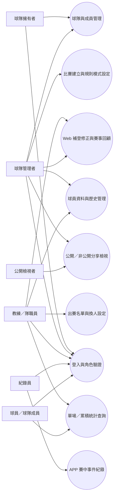

## Core Data Concepts

- **使用者帳號**：可登入平台並被指派一個或多個平台或球隊層級角色。
- **角色權限**：定義使用者可見範圍與可執行操作，例如球隊管理、賽中記錄、只讀檢視。
- **球隊**：球員、成員、比賽與統計的核心歸屬單位，可包含多位管理者與多個賽季資料。
- **球隊成員**：與球隊關聯的使用者，可能同時具有教練、紀錄員或一般成員角色。
- **球員**：可被登錄、排入名單、指派守位與保留歷史紀錄的人員，不一定對應平台帳號。
- **球員帳號連結**：球隊名單中的球員可選擇性連結至某個使用者；未連結時仍可存在與出賽，並可於後續補做連結。
- **球員歷史紀錄**：保留球員在不同時間點的背號、守位、在隊狀態與參與紀錄。
- **比賽**：包含日期、地點、對手、賽事類型、主客場、規則集、分享設定、分類、結果裁定與狀態。
- **賽程行事曆**：以球隊或個人視角呈現比賽日期分布、狀態、報名截止與通知狀態。
- **個人視角**：未選擇球隊時的預設操作上下文，只顯示使用者本人相關的賽程、通知、回覆、個人資料摘要與個人成績。
- **當前球隊上下文**：使用者主動選擇的一支球隊，用來決定目前顯示的球隊行事曆、球隊成績、球隊管理功能與資料範圍。
- **當前身分上下文**：使用者在目前球隊下切換的操作身分，例如球員、教練、管理者或紀錄員，用於調整首頁捷徑、管理入口與頁面強調重點。
- **出賽回覆**：球員或成員對特定比賽回覆參加、不參加、待定或尚未回覆的狀態。
- **通知任務**：針對新比賽、時間異動、報名提醒或截止提醒所產生的站內通知紀錄。
- **記錄輸入來源**：描述賽事事件是透過手動操作、掃描輔助或語音輔助建立，供後續擴充不同記錄方式時辨識。
- **規則集**：由平台提供預設規則集，並允許球隊在受控範圍內微調；其內容決定棒球／壘球、正式賽／友誼賽、9 人／10 人／DH／EP、再上場與名單驗證邏輯。
- **比賽分類**：用於標示比賽屬於盃賽、聯盟賽或友誼賽，供統計、戰績與報表篩選使用。
- **結果裁定**：描述比賽最終以勝、負、和、棄賽、延賽、對手棄權、違規判負、違規判勝等何種方式結案。
- **戰績納入方式**：決定某場比賽是否計入球隊戰績、如何在報表中顯示，並與球員成績統計範圍分開管理。
- **報表期間**：以 3 個月、1 年或自訂區間產出的統計與戰績檢視範圍。
- **出賽名單**：比賽中的先發打序、守位安排、替補名單與可上場球員集合。
- **賽事事件**：逐筆記錄打席結果、得分、出局、壘包、換人、代打、代跑、守位調整與投手更換。
- **單場成績**：由單一比賽事件彙整出的個人與球隊表現結果。
- **累積成績**：跨比賽、跨時間條件彙整的球員或球隊統計。
- **分享檢視**：決定哪些比賽與統計可被公開或僅限特定角色檢視。

## 使用者情境與測試（必要）

### 使用者故事 1 - 登入、首頁行事曆與上下文切換（優先度：P1）

多球隊使用者希望在登入後直接進入行事曆首頁，並透過右上角的登入／管理／球隊切換／身分切換入口，
在個人與不同球隊之間快速切換，避免一進系統就先面對模組列表或錯誤的球隊資料。

**優先原因**：如果首頁不是從真實使用情境出發，而是從模組出發，使用者很難快速進入每日最常用的賽程與通知脈絡，
也無法正確判斷自己目前是在個人視角還是某支球隊的視角。

**獨立驗證方式**：只靠 Web 的首頁、右上角全域操作區與行事曆切換，即可完成登入、查看個人行事曆、
切換到指定球隊、切換當前身分，並驗證未選擇球隊時不顯示球隊層級資料。

**平台焦點**：Web 以行事曆首頁與全域上下文切換為主；APP 承接個人賽程與賽中記錄情境。

**驗收情境**：

1. **Given** 使用者進入 Web 平台首頁，**When** 尚未登入，**Then** 系統於右上角提供登入入口，且主要畫面聚焦於行事曆首頁架構。
2. **Given** 使用者完成登入但尚未選擇球隊，**When** 進入首頁，**Then** 系統預設顯示個人行事曆、個人通知與個人回覆狀態。
3. **Given** 使用者同時屬於多支球隊，**When** 透過右上角球隊切換器選擇其中一隊，**Then** 首頁切換為該球隊的行事曆與球隊相關資料。
4. **Given** 使用者在同一支球隊中具備多種身分，**When** 透過右上角身分切換器改為管理者或球員身分，**Then** 首頁捷徑與管理入口依當前身分調整，但權限不得超出實際授權。
5. **Given** 使用者尚未選擇球隊，**When** 嘗試查看球隊成績、球隊名單或球隊管理內容，**Then** 系統要求先選擇球隊，並維持個人視角資料不變。
6. **Given** 使用者為球員或球隊成員，**When** 停留在個人視角並開啟統計頁，**Then** 系統顯示其個人成績，而不要求先選擇球隊。

#### 循序圖

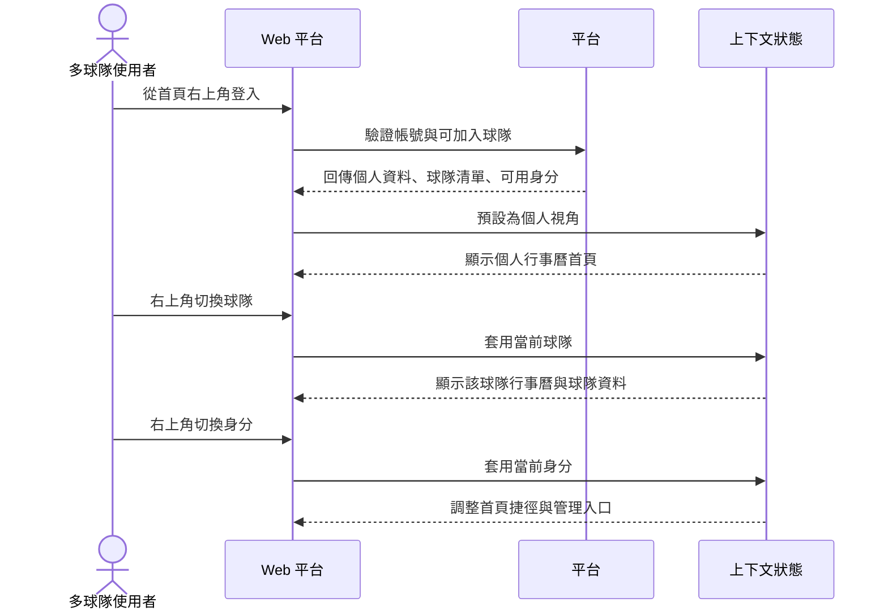

---

### 使用者故事 2 - 球員資料與歷史管理（優先度：P1）

球隊管理者希望能維護球員基本資料、背號、守位、在隊狀態，並保留歷史變更紀錄，
以便在不同賽季與不同規則模式下正確選擇可用球員。

**優先原因**：球員名單與歷史狀態是出賽名單、換人與統計計算的前提。

**獨立驗證方式**：只靠 Web 的球員資料管理畫面，即可新增球員、調整背號與守位、
變更在隊狀態並查閱歷史紀錄。

**平台焦點**：Web 主操作，APP 可在賽中選擇或查閱可用球員。

**驗收情境**：

1. **Given** 球隊尚未建立球員名單，**When** 管理者新增球員並設定背號、主要守位與在隊狀態，**Then** 該球員可被納入後續比賽名單。
2. **Given** 某球員曾更換背號或離隊後回隊，**When** 管理者查閱球員歷史，**Then** 系統顯示每次變更的時間脈絡與狀態差異。
3. **Given** 某球員尚未有平台帳號，**When** 管理者先建立該球員資料並於之後連結到某個使用者帳號，**Then** 系統保留原球員資料、歷史紀錄與後續連結關係。

#### 循序圖

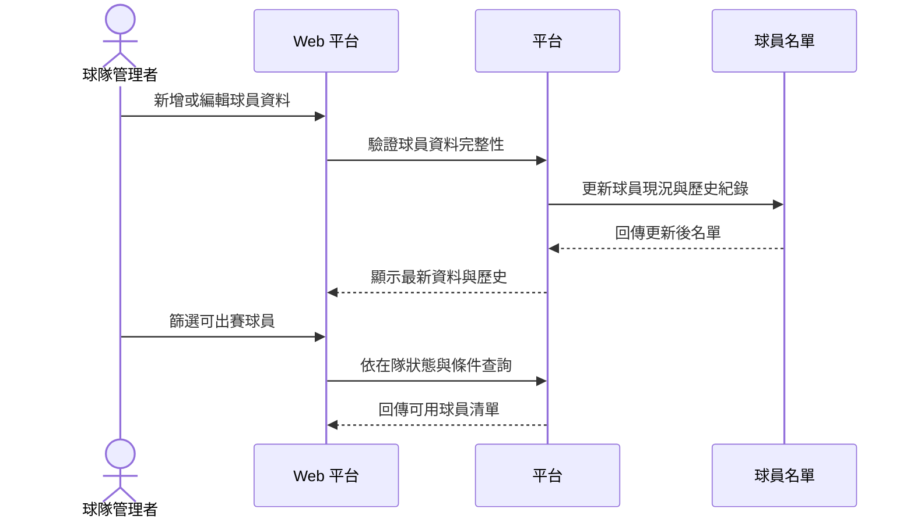

---

### 使用者故事 3 - 比賽建立、規則集與出賽名單（優先度：P1）

球隊管理者或教練希望能建立比賽、選擇棒球或壘球規則、設定正式賽或友誼賽模式、
安排先發打序與守位，並在換人與再上場時依規則集受到驗證。

**優先原因**：若比賽與規則集未先定義，賽中事件記錄與統計結果無法被正確解讀。

**獨立驗證方式**：只靠 Web 的比賽建立與出賽名單設定畫面，即可建立新比賽、挑選規則模式、
設定先發與替補，並驗證不同規則下的名單合法性。

**平台焦點**：Web 主操作，APP 在賽中沿用已確認之名單與規則集。

**驗收情境**：

1. **Given** 球隊已建立球員名單，**When** 管理者建立壘球友誼賽並選用 EP 模式，**Then** 系統允許超過正式守備人數的登錄與出賽安排。
2. **Given** 比賽採用支援再上場一次的壘球規則，**When** 教練安排先發退場後再回到比賽，**Then** 系統依該規則集判定是否允許再上場。

#### 循序圖

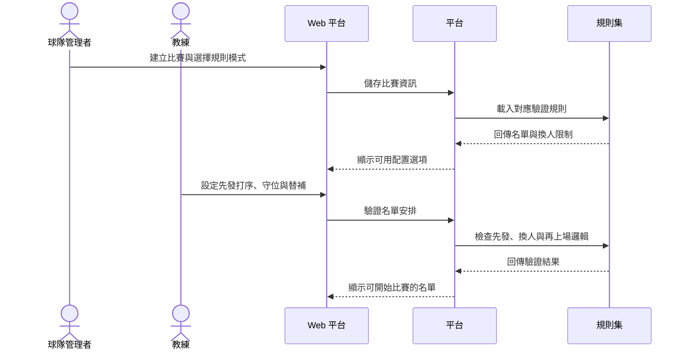

---

### 使用者故事 3A - 球隊與個人賽程行事曆、通知與報名（優先度：P1）

球隊管理者希望在建立比賽後，球隊行事曆與個人行事曆都能看到賽程，並可對球員發送出賽通知、
收集參加回覆與統計人數，以便在開賽前完成名單準備與人力盤點。

**優先原因**：若沒有賽程通知與報名回覆，球隊很難在賽前確認實際可出賽人數，也無法有效安排先發與替補。

**獨立驗證方式**：只靠 Web 的比賽與行事曆頁、APP 的首頁或賽程頁，即可查看球隊與個人賽程、送出出賽回覆，
並看到參加、不參加、待定與未回覆人數統計。

**平台焦點**：Web 側重賽程建立、通知發送、回覆總覽與人數統計；APP 側重個人接收通知、查看行程與快速回覆。

**驗收情境**：

1. **Given** 球隊已建立新比賽，**When** 管理者開啟球隊行事曆，**Then** 系統顯示該比賽的日期、狀態、對手與報名狀態摘要。
2. **Given** 某成員具有個人行事曆檢視權限，**When** 該成員查看自己的賽程，**Then** 系統顯示其所屬球隊相關比賽與個人的出賽回覆狀態。
3. **Given** 比賽已發送報名通知，**When** 成員回覆參加、不參加或待定，**Then** 系統更新該場比賽的報名統計與名單準備資訊。
4. **Given** 平台尚未串接外部通訊工具，**When** 管理者檢視通知設定，**Then** 系統仍可保留未來支援 LINE 或其他外部回覆通道的擴充邊界，但不要求本階段實作。

#### 循序圖

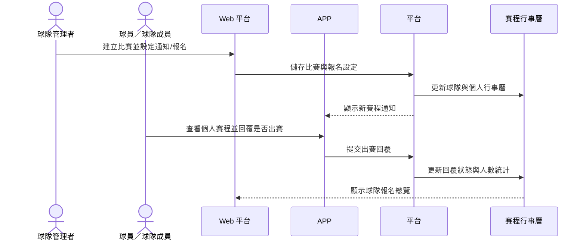

---
### 使用者故事 4 - APP 賽中即時事件紀錄（優先度：P1）

紀錄員希望在 APP 中快速記錄每個打席、比分、出局數、壘包狀態、投手更換、
代打、代跑與守位調整，讓比賽進行中就能維持正確的場上狀態與即時成績。

**優先原因**：賽中事件紀錄是本平台最核心的價值來源，沒有它就無法形成單場與累積統計。

**獨立驗證方式**：只靠 APP 的賽中記錄畫面，即可從開賽到比賽結束連續記錄事件，
並在每一步看到比分、壘包、出局與上場球員狀態同步變化。

**平台焦點**：APP 主操作，Web 可同步查閱或賽後補登修正。

**驗收情境**：

1. **Given** 比賽已完成名單設定並進入進行中，**When** 紀錄員逐筆輸入打席結果與換人事件，**Then** 系統即時更新比分、出局數、壘包狀態與場上球員。
2. **Given** 比賽採用不同規則模式，**When** 紀錄員執行代打、代跑、守位調整或再上場，**Then** 系統依比賽規則集提示可行或不可行結果。
3. **Given** 該場次尚未預先設定紀錄員，**When** 具資格成員申請該場次紀錄權限並通過審核，**Then** 系統允許其進行該場比賽的即時記錄與賽後補登。

#### 循序圖

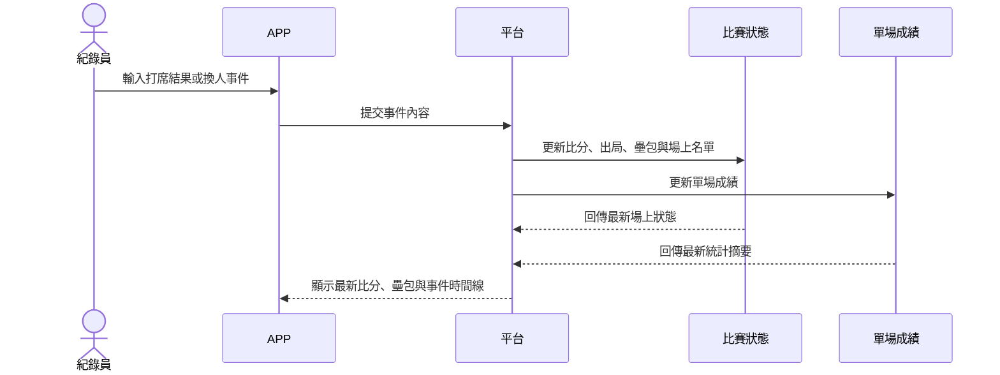

---

### 使用者故事 5 - Web 補登修正、統計查詢與公開分享（優先度：P2）

教練、球隊管理者與球員希望在 Web 上補登或修正事件、查詢單場與累積統計、
回顧賽事過程，並依公開設定分享比賽結果給隊內或外部檢視者。

**優先原因**：賽後回顧與分享能放大紀錄價值，但不影響 MVP 的賽中紀錄核心閉環。

**獨立驗證方式**：只靠 Web 的賽事回顧、查詢與分享畫面，即可補正比賽資料、
檢視球員與球隊統計、切換公開／非公開並驗證外部檢視權限。

**平台焦點**：Web 主操作，APP 可提供個人化查看與簡要回顧。

**驗收情境**：

1. **Given** 比賽已記錄完成，**When** 教練於 Web 補登或修正某一局事件，**Then** 單場與累積統計會重新反映最新結果。
2. **Given** 比賽被設定為公開分享，**When** 外部檢視者開啟分享檢視，**Then** 系統僅顯示被允許公開的賽事內容與統計摘要。

#### 循序圖

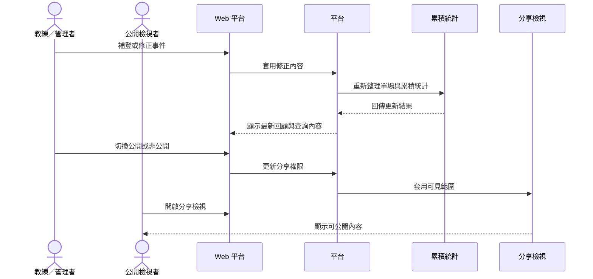

---

### 使用者故事 5A - 戰績分類、特殊結果與區間報表（優先度：P2）

球隊管理者與教練希望能依盃賽、聯盟賽、友誼賽等分類查看球員成績與球隊戰績，
並支援 3 個月、1 年或自訂區間報表，同時能處理延賽、棄賽、對手棄權、違規判勝負等特殊結果，
以便對外呈現與隊內檢討時有一致的統計口徑。

**優先原因**：若比賽分類、特殊結果與報表期間無法被清楚處理，球隊戰績與球員成績會混在一起，難以反映實際競賽脈絡。

**獨立驗證方式**：只靠 Web 的統計與報表頁，即可依比賽分類切換分開、合併或部分合併視圖，並產出 3 個月、1 年與自訂區間報表，同時驗證特殊結果是否納入戰績。

**平台焦點**：Web 主操作；APP 可查閱比賽分類與最終裁定結果摘要。

**驗收情境**：

1. **Given** 球隊同時有盃賽、聯盟賽與友誼賽資料，**When** 管理者查看報表，**Then** 系統可依分類分開顯示，或將指定分類做部分合併顯示。
2. **Given** 管理者選擇 3 個月、1 年或自訂區間，**When** 產生球員成績與球隊戰績報表，**Then** 系統依所選區間與分類條件輸出一致結果。
3. **Given** 某場比賽被標示為延賽、棄賽、對手棄權、違規判負或違規判勝，**When** 管理者設定是否納入戰績，**Then** 系統依設定更新球隊戰績，並清楚標示該比賽的結果裁定狀態。

#### 循序圖

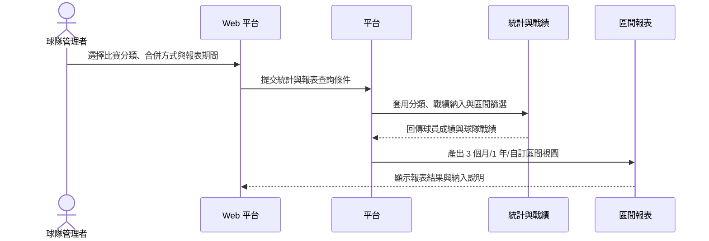

### 邊界情境

- 當友誼賽模式下的實際登錄人數超過正式守備人數時，系統不得把此情況直接判定為非法。
- 當比賽規則由棒球切換為壘球，或由正式賽切換為友誼賽時，已建立名單與換人邏輯需重新依規則集驗證。
- 當比賽進行中發生補登、修正或回溯編輯時，系統必須重新計算單場與累積統計。
- 當比賽被標示為延賽時，該場不得被視為已完成賽果，也不得直接納入戰績。
- 當比賽被標示為棄賽、對手棄權、違規判負或違規判勝時，系統必須保留其裁定結果，並允許依設定決定是否納入球隊戰績。
- 當管理者切換報表區間、比賽分類或合併方式時，球員成績與球隊戰績都必須依同一組條件重算。
- 當球員離隊、暫停參賽或重新回隊時，歷史紀錄必須保留，不得覆蓋先前狀態。
- 當比賽設為非公開時，未被授權者不得查看賽事內容、成績與事件時間線。
- 當該場次沒有預先設定紀錄員時，具資格成員可申請該場次紀錄權限，且未核准前不得開始記錄或補登。

### 狀態圖

#### 比賽狀態圖

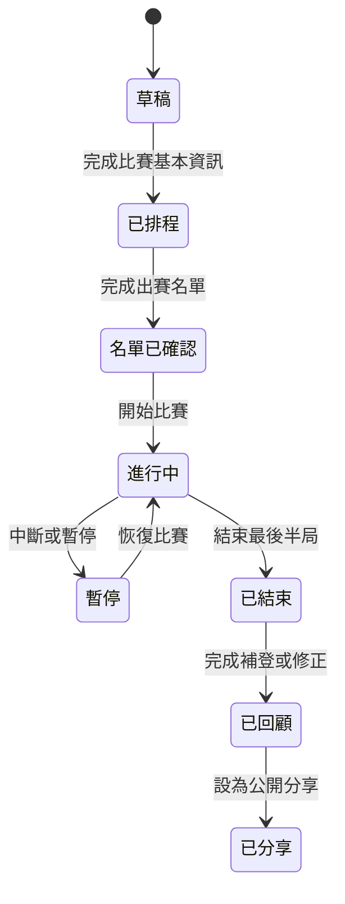

#### 比賽結果狀態圖

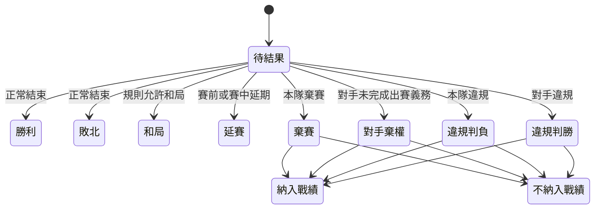

#### 球員出賽／再上場狀態圖

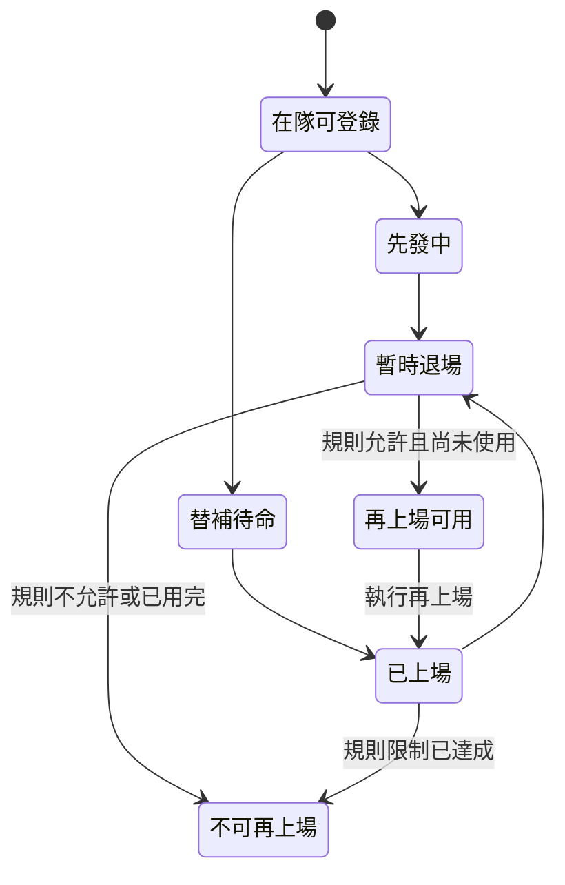

## 需求（必要）

### Functional Requirements

#### 帳號、身分與權限

- **FR-001**：系統 MUST 提供帳號登入機制，讓使用者以單一身分進入平台。
- **FR-001A**：系統 MUST 在 Web 畫面的右上角提供全域操作區，集中呈現登入、帳號、管理、球隊切換與身分切換入口。
- **FR-001B**：系統 MUST 在使用者登入後預設進入行事曆首頁，而不是模組導覽頁。
- **FR-001C**：系統 MUST 在未選擇球隊時以個人視角作為預設上下文，僅顯示個人相關資訊。
- **FR-001D**：系統 MUST 支援同一使用者在多支所屬球隊之間切換當前球隊上下文。
- **FR-001E**：系統 MUST 支援使用者在當前球隊下切換可用身分上下文，以改變首頁捷徑、強調內容與管理入口。
- **FR-001F**：系統 MUST 在未選擇球隊時隱藏或禁用球隊層級的成績、名單、管理與隊務內容。
- **FR-001G**：系統 MUST 要求所有角色（包含非球員角色）先選擇球隊，才能查看該球隊的成績、名單、比賽與管理資訊。
- **FR-001H**：系統 MUST 在切換當前球隊或身分後，讓首頁、行事曆、統計與管理入口同步反映新的上下文。
- **FR-001I**：系統 MUST 允許球員或球隊成員在未選擇球隊的個人視角下查看自己的個人成績。
- **FR-002**：系統 MUST 支援平台角色與球隊角色兩層級的權限區分。
- **FR-003**：系統 MUST 支援同一使用者同時屬於多支球隊，且在不同球隊或同一球隊中可同時具備多個角色。
- **FR-004**：系統 MUST 讓球隊擁有者或球隊管理者邀請成員加入球隊。
- **FR-005**：系統 MUST 讓被授權者設定或變更球隊成員角色。
- **FR-006**：系統 MUST 限制未授權者不得存取球隊管理、賽中記錄與非公開賽事資料。
- **FR-006A**：系統 MUST 允許球隊擁有者、球隊管理者、教練與紀錄員進行賽後補登與修正。
- **FR-006B**：系統 MUST 在該場次尚無紀錄員時，允許具資格的球隊成員申請該場次紀錄權限，並於審核通過後生效。
- **FR-006C**：系統 MUST 僅允許球隊擁有者、球隊管理者或教練審核該場次臨時紀錄權限申請。

#### 球隊與球員管理

- **FR-007**：系統 MUST 支援球隊建立、基本資料維護與球隊狀態管理。
- **FR-008**：系統 MUST 支援建立與維護球員資料。
- **FR-008A**：系統 MUST 支援在沒有平台帳號的情況下建立球員資料。
- **FR-009**：系統 MUST 記錄球員背號、守位、在隊狀態與可出賽狀態。
- **FR-010**：系統 MUST 保留球員資料變更的歷史紀錄，而非只保留最新狀態。
- **FR-011**：系統 MUST 讓管理者依在隊狀態、守位或其他條件篩選球員。
- **FR-012**：系統 MUST 區分球隊成員與球員的關聯，允許隊職員不一定同時為球員。
- **FR-012A**：系統 MUST 支援球員與使用者帳號的選擇性連結，且可在球員建立後再補做連結。
- **FR-013**：系統 MUST 在比賽建立與名單設定時，只納入符合當前條件的可用球員。

#### 比賽、規則集與名單設定

- **FR-014**：系統 MUST 支援建立比賽並記錄日期、地點、對手、賽事類型、主客場與比賽狀態。
- **FR-014G**：系統 MUST 讓每場比賽標示盃賽、聯盟賽或友誼賽等分類，供統計、戰績與報表使用。
- **FR-014H**：系統 MUST 區分比賽流程狀態與最終結果裁定，讓比賽可被標示為勝、負、和、棄賽、延賽、對手棄權、違規判負或違規判勝。
- **FR-014I**：系統 MUST 讓管理者決定特殊結果裁定是否納入球隊戰績，且該決定需可被查詢與報表辨識。
- **FR-014A**：系統 MUST 在球隊視角提供賽程行事曆，讓管理者依日期查看比賽安排、狀態與報名摘要。
- **FR-014B**：系統 MUST 在個人視角提供賽程行事曆，讓成員查看自己相關的比賽與個人回覆狀態。
- **FR-014C**：系統 MUST 支援在比賽建立或時間異動後產生通知，提醒相關成員查看與回覆出賽狀態。
- **FR-014D**：系統 MUST 支援成員對比賽回覆參加、不參加、待定或尚未回覆，並顯示回覆時間與最新狀態。
- **FR-014E**：系統 MUST 針對每場比賽統計參加、不參加、待定與未回覆人數，供球隊安排出賽名單參考。
- **FR-014F**：系統 MUST 保留未來串接 LINE 或其他外部報名/通知通道的業務邊界，但本階段不得要求實際外部串接。
- **FR-015**：系統 MUST 在每場比賽中指定棒球或壘球規則類型。
- **FR-016**：系統 MUST 支援正式賽與友誼賽兩種賽事模式。
- **FR-017**：系統 MUST 支援 9 人、10 人、DH、EP 等不同先發與打序配置模式。
- **FR-017A**：系統 MUST 在友誼賽等允許彈性調度的情境中，支援實際出賽人數依球員加入或離場而動態增減。
- **FR-018A**：系統 MUST 以平台預設規則集為基底，並僅允許球隊切換棒球／壘球與正式賽／友誼賽兩類規則參數。
- **FR-019**：系統 MUST 支援建立出賽名單、先發打序、守位、替補與預備上場安排。
- **FR-020**：系統 MUST 在部分壘球規則適用時，支援再上場一次的業務邏輯。
- **FR-021**：系統 MUST 在友誼賽模式下允許實際登錄或出賽人數超過正式守備人數，且可因現場加入或離場而動態調整。

#### 賽中事件與比賽進行

- **FR-022**：系統 MUST 讓紀錄員逐筆記錄打席結果。
- **FR-022A**：系統 MUST 保留未來支援掃描與語音輔助記錄賽事事件的業務邊界，但 MVP 先以手動畫面操作為主。
- **FR-022B**：系統 MUST 在未來啟用多種記錄方式時，仍能讓紀錄員確認事件內容後才寫入正式賽事紀錄。
- **FR-023**：系統 MUST 在每筆事件後更新得分、出局數與壘包狀態。
- **FR-024**：系統 MUST 支援紀錄投手更換、代打、代跑、守位調整與其他換人事件。
- **FR-025**：系統 MUST 在賽中依照比賽規則集驗證先發、換人、打序與再上場邏輯。
- **FR-026**：系統 MUST 保留賽事事件時間線，供賽後回顧與修正。
- **FR-027**：系統 MUST 支援在比賽進行中與賽後補登遺漏事件。
- **FR-028**：系統 MUST 在事件被新增、刪除或修正時重新反映最新比賽狀態。

#### 成績統計、查詢與回顧

- **FR-029**：系統 MUST 產出單場成績統計。
- **FR-030**：系統 MUST 產出球員累積成績統計。
- **FR-030A**：系統 MUST 讓球員或球隊成員在個人視角查看自己的單場與累積個人成績，且不需先選擇球隊。
- **FR-031**：系統 MUST 產出球隊累積成績統計。
- **FR-031A**：系統 MUST 產出球隊戰績摘要，並區分一般勝負和特殊結果裁定。
- **FR-032**：系統 MUST 支援依球員、球隊、日期區間、賽事類型、規則模式等條件查詢成績。
- **FR-032A**：系統 MUST 支援依盃賽、聯盟賽、友誼賽等比賽分類篩選球員成績與球隊戰績。
- **FR-032B**：系統 MUST 支援將球員成績與球隊戰績以分開、全部合併或指定分類部分合併的方式呈現。
- **FR-032C**：系統 MUST 支援以 3 個月、1 年或自訂區間產出球員成績與球隊戰績報表。
- **FR-033**：系統 MUST 提供賽事回顧視角，讓使用者依事件時間線回看比賽過程。
- **FR-034**：系統 MUST 在 Web 中支援補登與修正後重新整理相關統計與回顧內容。
- **FR-034A**：系統 MUST 在比賽分類、結果裁定或戰績納入設定變更後重新整理球員成績、球隊戰績與區間報表。

#### 公開分享與可見範圍

- **FR-035**：系統 MUST 讓比賽可被設定為公開或非公開。
- **FR-036**：系統 MUST 依分享設定限制賽事、統計與事件內容的可見範圍。
- **FR-037**：系統 MUST 提供公開檢視者可使用的分享檢視畫面。
- **FR-038**：系統 MUST 區分隊內成員檢視與公開檢視的資料深度。
- **FR-038A**：系統 MUST 由平台系統設定決定公開分享套用的資料粒度，並在預先定義的公開層級中選擇一種模式。

#### 公開分享層級暫定定義（MVP）

- **Tier A**：公開賽事基本資訊、比分、比賽狀態、最終結果與公開摘要。
- **Tier B**：在 Tier A 基礎上，額外公開先發名單、守位摘要與單場摘要統計。
- **Tier C**：在 Tier B 基礎上，額外公開事件時間線與完整單場統計。
- 所有 Tier 均為只讀，不公開隊內管理欄位、角色設定、邀請資訊、內部通知與可編輯操作。

#### 平台使用情境分工

- **FR-039**：系統 MUST 讓 APP 的主要使用情境聚焦於賽中即時記錄與快速操作。
- **FR-040**：系統 MUST 讓 Web 的主要使用情境聚焦於資料管理、補登修正、統計查詢與賽事回顧。
- **FR-041**：系統 MUST 確保 Web 與 APP 面對同一場比賽時，看到一致的規則模式、事件結果與統計脈絡。

### Rule Modes

- **RM-001 棒球／壘球切換**：每場比賽都必須先選定棒球或壘球，並以此決定可套用的規則集與驗證邏輯。
- **RM-002 正式賽／友誼賽模式**：正式賽強調名單與換人合法性；友誼賽允許更彈性的登錄與出賽人數安排。
- **RM-003 先發配置模式**：系統需支援 9 人、10 人、DH、EP 等配置，並反映到打序、守位與上場資格的判定；在友誼賽等彈性模式中，實際出賽人數可動態增減。
- **RM-004 再上場機制**：規則集可定義是否允許部分壘球規則中的再上場一次，並指出適用對象與次數限制。
- **RM-005 規則集微調模式**：球隊僅可在平台預設規則集上切換棒球／壘球與正式賽／友誼賽，不得直接自訂其他規則欄位。
- **RM-006 分享模式**：每場比賽需獨立決定公開或非公開，並影響檢視者可見範圍。
- **RM-007 公開粒度模式**：公開分享的資料粒度由平台系統設定統一決定，僅可套用預先定義的公開層級。
- **RM-008 比賽分類模式**：每場比賽需標示其屬於盃賽、聯盟賽或友誼賽，並作為戰績與報表的篩選維度。
- **RM-009 結果裁定模式**：比賽完成後可依實際情況被標示為一般賽果或特殊裁定結果，並獨立決定是否納入戰績。

### Validation Rules

- **VR-001**：比賽的先發名單、守位安排與打序必須依該場規則集驗證，不得套用其他比賽的固定標準。
- **VR-001A**：球隊行事曆與個人行事曆對同一場比賽顯示的日期、狀態與報名摘要必須一致。
- **VR-001B**：Web 右上角全域操作區必須清楚顯示目前登入狀態、當前球隊上下文與當前身分上下文，避免使用者誤判目前資料範圍。
- **VR-001C**：當前球隊未選擇時，系統不得顯示或誤用任何球隊層級的成績、管理操作或球隊資料摘要。
- **VR-001C-1**：當前球隊未選擇時，若使用者為球員或球隊成員，系統仍可顯示其個人成績，但不得混入任何未選定球隊的球隊層級統計。
- **VR-001D**：當使用者切換當前球隊後，行事曆、球隊成績、球隊名單與管理入口必須同步切換到同一支球隊，不得混用先前球隊資料。
- **VR-001E**：當使用者切換當前身分後，首頁捷徑與管理入口可改變，但可執行操作不得超出該使用者在該球隊中的實際授權。
- **VR-002**：若規則集不允許再上場，任何再上場嘗試都必須被標示為不合法。
- **VR-003**：若規則集允許再上場一次，系統必須追蹤該球員是否已使用該次數。
- **VR-004**：友誼賽模式下，即使登錄或實際出賽人數超過正式守備人數，或因球員加入與離場而持續變動，仍應視為可接受情境。
- **VR-005**：正式賽模式下，若名單配置不符合規則集要求，系統必須在開賽前提示並要求修正。
- **VR-006**：每筆賽事事件都必須對應到明確的比賽上下文，包含當前局數、出局數、壘包狀態與場上球員。
- **VR-007**：事件修正後，系統必須以修正後的事件時間線重新驗證場上狀態與統計。
- **VR-008**：球隊對規則集的微調只可作用於平台允許的欄位，且不得破壞原規則集的基本驗證結構。
- **VR-009**：非公開賽事的內容不得經由公開分享檢視被存取。
- **VR-010A**：公開分享頁面僅可顯示平台系統設定所允許的公開層級內容，不得由單一賽事任意突破。
- **VR-010**：未具備賽後補登或修正權限的使用者不得修改該場賽事事件。
- **VR-011**：該場次紀錄權限申請未經核准前，申請者不得開始該場賽事的記錄或修正。
- **VR-012**：只有球隊擁有者、球隊管理者或教練可核准該場次臨時紀錄權限。
- **VR-013**：未連結帳號的球員仍可存在於球隊名單、出賽名單與賽事事件中；後續完成帳號連結時不得破壞既有歷史紀錄、出賽資料與統計關聯。
- **VR-014**：比賽報名統計必須依最新回覆狀態重新計算，且同一成員於同一場比賽僅能存在一個有效回覆狀態。
- **VR-015**：未具備該球隊或該比賽檢視權限的使用者，不得查看球隊行事曆、個人賽程或通知內容。
- **VR-016**：若本階段未啟用外部報名通道，所有報名與通知互動皆以平台內部畫面為準，不得假設外部回覆已同步生效。
- **VR-017**：若未來啟用掃描或語音輔助記錄，任何自動辨識結果都不得直接覆蓋正式賽事事件，必須經過紀錄員確認。
- **VR-018**：延賽狀態的比賽不得被視為已完成賽果，也不得直接納入球隊戰績或完成報表結算。
- **VR-019**：棄賽、對手棄權、違規判負與違規判勝等特殊結果，必須保留其裁定類型與是否納入戰績的設定。
- **VR-020**：球員成績與球隊戰績在分開、合併或部分合併視圖中，都必須清楚標示實際納入的比賽分類與區間條件。
- **VR-021**：若比賽未產生有效賽事事件或未達成正式記錄條件，系統不得產生該場的球員正式成績，但仍可保留戰績裁定資訊。

### Non-functional Requirements

- **NFR-001**：APP 的賽中記錄流程必須支援高頻、低干擾的連續操作，避免紀錄員因切換步驟而中斷比賽記錄。
- **NFR-002**：Web 的查詢與回顧流程必須讓管理者可在單一工作脈絡下完成篩選、比對與修正。
- **NFR-003**：平台必須讓不同角色清楚辨識自己可操作與僅可檢視的內容，降低誤操作風險。
- **NFR-004**：平台必須保留賽事、球員與球隊資料的可追溯性，讓歷史變更能被查閱。
- **NFR-005**：公開分享內容必須以只讀方式呈現，避免未授權者修改賽事資料。
- **NFR-006**：平台必須支援同一球隊在多場比賽、多種規則模式下維持資料一致性與可理解性。
- **NFR-007**：賽程行事曆、通知與報名回覆流程必須讓使用者在最少步驟內確認是否出賽，避免賽前回覆成本過高。
- **NFR-008**：未來若擴充掃描或語音記錄，不能破壞現有手動記錄流程的穩定性與可理解性。
- **NFR-009**：統計、戰績與區間報表畫面必須清楚揭露納入的比賽分類、特殊結果與排除條件，避免誤讀。

## Success Criteria（必要）

### MVP Acceptance Criteria

- 使用者登入後會直接進入行事曆首頁，且可從右上角切換個人／球隊／身分上下文。
- 球隊擁有者可完成登入、建立球隊、邀請成員並設定角色。
- 球隊管理者可建立球員名單並保留球員歷史狀態。
- 球隊管理者可建立一場棒球或壘球比賽、選擇正式賽或友誼賽、設定出賽名單並通過規則驗證。
- 紀錄員可在 APP 中完整記錄一場比賽的主要事件，並即時看到比分、壘包與出局變化。
- 教練或管理者可在 Web 補登或修正事件，並看到單場與累積統計同步更新。
- 球隊管理者可在 Web 查看球隊行事曆、發送出賽通知並掌握各場次報名人數統計。
- 球員或成員可在 APP 或 Web 查看個人賽程，並完成出賽回覆。
- 球員或成員可在未選擇球隊時，於個人視角查看自己的個人成績。
- 球隊管理者可在 Web 依盃賽、聯盟賽、友誼賽分類查看球員成績、球隊戰績，並切換 3 個月、1 年或自訂區間報表。
- 球隊管理者可將延賽、棄賽、對手棄權、違規判負或違規判勝等特殊結果正確反映到戰績視圖。
- 公開檢視者只能查看被設定為公開的賽事內容。

### 可衡量結果

- **SC-001**：新球隊可在 15 分鐘內完成帳號、球隊、球員與首場比賽的基本設定。
- **SC-001A**：多球隊使用者可在 10 秒內從個人行事曆切換到任一所屬球隊的行事曆，並明確辨識目前所在球隊與身分。
- **SC-002**：紀錄員可在賽中於不離開主要記錄流程的情況下完成連續事件登錄，並維持比分與場上狀態一致。
- **SC-003**：管理者可在 3 分鐘內查出指定球員於指定條件下的累積成績與相關比賽。
- **SC-004**：同一場比賽在 Web 與 APP 上呈現的規則模式、事件時間線與統計結果保持一致。
- **SC-005**：至少 90% 的主要使用案例可由使用者在不需要額外說明的情況下完成首輪操作與檢視。
- **SC-006**：球隊管理者可在 3 分鐘內查看任一場比賽的參加、不參加、待定與未回覆人數摘要。
- **SC-007**：球員或成員可在 1 分鐘內從個人賽程完成單場比賽的出賽回覆。
- **SC-008**：球隊管理者可在 3 分鐘內切換盃賽、聯盟賽、友誼賽的分開、合併或部分合併統計視圖。
- **SC-009**：球隊管理者可在 5 分鐘內產出 3 個月、1 年或自訂區間的球員成績與球隊戰績報表。

## Assumptions

- Web 首頁以行事曆為主要入口，登入、管理、球隊切換與身分切換集中在右上角全域操作區。
- 未選擇球隊時，系統僅呈現個人相關內容；個人成績可於個人視角查看，但所有球隊層級內容都需在選定球隊後才顯示。
- 身分切換主要用於調整目前操作視角與入口，不得突破使用者原本已被授權的權限範圍。
- 一個帳號可同時屬於多支球隊，且各球隊角色互不影響。
- 所有統計以平台內已建立與已確認的賽事資料為準，不納入外部聯盟來源。
- 公開分享預設為只讀檢視，不包含編輯能力。
- Web 為管理、查詢與回顧的主要場景；APP 為賽中即時記錄的主要場景。
- 賽程通知與出賽回覆在 MVP 階段以平台內部通知與操作流程為準，不實作 LINE 或其他外部通訊串接。
- 掃描與語音記錄屬未來擴充能力，本階段不實作辨識流程，僅保留規格邊界。
- 季報以 3 個月區間理解，年報以 1 年區間理解，並可另行指定自訂起迄區間。
- 不同規則集由平台事先提供，球隊僅可在平台允許的範圍內微調後套用至比賽。
- 公開分享的 A/B/C 層級定義於 MVP 階段固定採用本文件的暫定定義，並由靜態設定檔控制。
- 臨時紀錄權限申請在 MVP 階段不實作自動逾時，僅保留待審核、已核准、已拒絕三種狀態。
- 戰績與報表在 MVP 階段預設以比賽分類分開顯示，且特殊結果預設不納入球隊戰績。
- 外部通知/報名通道與掃描/語音記錄在 MVP 階段僅以 disabled placeholder、來源欄位或待確認狀態保留擴充邊界。

## GAP / Open Questions

- 未來若串接 LINE 或其他外部通訊工具，通知送達、外部回覆回寫與身分對應規則仍需在後續階段定義。
- 未來若支援掃描或語音記錄，辨識來源、確認流程、誤判修正與事件草稿轉正式紀錄的規則仍需在後續階段定義。

